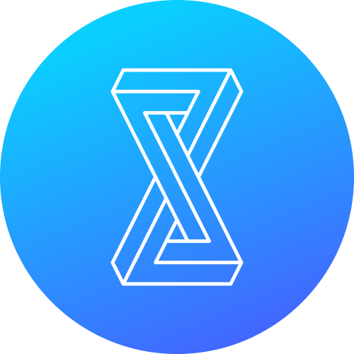

<br>
<p>
  Fitty is a helper for you to use <a href="https://support.zeplin.io/en/articles/1437093-comparing-app-website-with-designs-using-pop-out" target="_blank">Zeplin pop out</a> feature on Windows, MacOS, and Linux, currently support design wireframe from Zeplin and Figma
</p>
<br>

<hr />
<br />

<div align="center">


</div>

## How to start fitty for zeplin wireframe
1. Login to your zeplin account on <a href="https://app.zeplin.io/projects" target="_blank">Zeplin</a>.

2. Go to <a href="https://app.zeplin.io/profile/developer" target="_blank">Developer section</a> for your profile.

3. Create your Personal access tokens.

4. Paste it into Fitty > ControlPanel > Figma Section > `Token` Field
## How to start fitty for figma wireframe
1. Login to your Figma account on <a href="https://www.figma.com/" target="_blank">Figma</a>.
2. Head to the Account Settings from the top-left menu inside Figma.
3. Find the Personal Access Tokens section, click Create new token.
4. A token will be generated. This will be your only chance to copy the token, so make sure you keep a copy of this in a secure place.

5. Paste it into Fitty > ControlPanel > Figma Section > `Token` Field

## Variables
### General
| key  | type | Description |
| ------------- | ------------- | ------------- |
| Opacity  | Number  | value from 0 ~ 1 for frame's opacity |
| Scale  | Number | value is the percantage for the frame's scaling  |
### Zeplin
open the target page on web, you can get the variables from the URL (for example: https://app.zeplin.io/project/5d3961af5fd2632e5d62fc/screen/5e995dc1de21117e66ea7b/)
| key  | type | Description |
| ------------- | ------------- | ------------- |
| Project ID  | String  | for the URL above, project ID is `5d3961af5fd2632e5d62fc` |
| Section ID  | String | for the URL above, screen ID is `5e995dc1de21117e66ea7b` |

### Figma
select the frame on Figma, you can get the variables from the URL (for example: https://www.figma.com/file/RRpJmU5bfidxMFboh65ZaX/contra-wireframe-kit-(Community)?node-id=2%3A9167)
| key  | value | Description |
| ------------- | ------------- | ------------- |
| File ID  | String  | for the URL above, file ID is `RRpJmU5bfidxMFboh65ZaX` |
| Frame ID  | String  | for the URL above, frame ID is `2:9167`, (*%3A* is the Escape Code for `:` Character) |

## Install
```bash
yarn install
```

## Starting Development

Start the app in the `dev` environment. This starts the renderer process in [**hot-module-replacement**](https://webpack.js.org/guides/hmr-react/) mode and starts a webpack dev server that sends hot updates to the renderer process:

```bash
yarn dev
```

## Packaging for Production

To package apps for the local platform:

```bash
yarn package
```

## License

MIT © [Electron React Boilerplate](https://github.com/electron-react-boilerplate)
